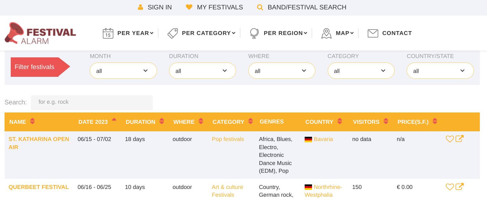
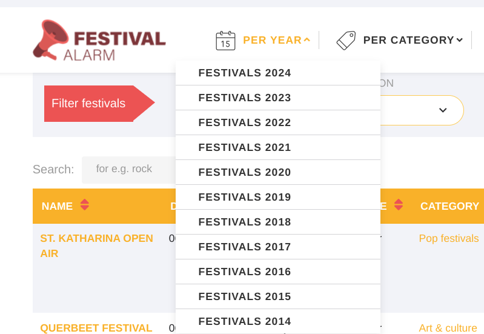
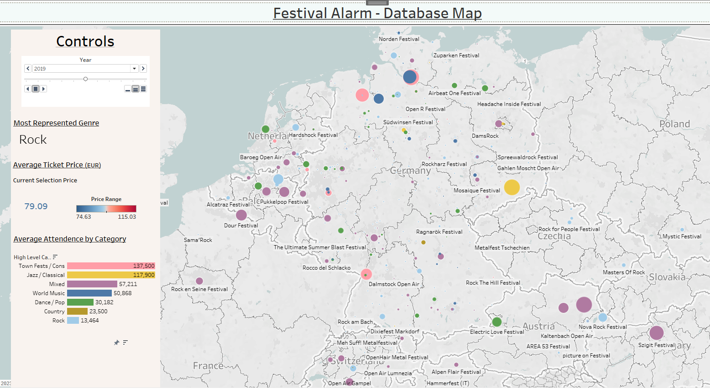

## Project Overview and Objectives

#### *Overview*

The following is a personal project where publicly available tables containing music festival data are web scraped, combined, cleaned, and visualized in Tableau.

#### *Objectives*

This project will have five main objectives:

1. Web scrape music festival data from Festival Alarm, a publicly available website that tracks music festival data (mainly in Europe)
2. Combine the scraped data into a single table
3. Perform a high-level analysis of the data and clean it as needed
4. Export the data to Tableau and create visualizations for publication
5. Document learnings and findings from the project

#### *A note on web scraping*

The Flatiron school data science boot camp teaches it's students to always check the terms and conditions of a website before web scraping. Festival Alarm does not have a terms and conditions page, but it does have a privacy policy page (however, it is in German, so this was translated using CHat GPT).

The privacy policy page does not explicitly state that web scraping is not allowed, but it does state that the website is not to be used for commercial purposes.I reached out to the website owners and waited a week for their response; none was given. Since this project is for educational purposes only and there is no explicit statement against web scraping, I decided to proceed with the project.

If anyone from Festival Alarm reads this and would like me to take down this project, please reach out to me and I will do so immediately. You can email me at mooreaz92@gmail.com or message me on GitHub.

**Website Overview**

The target website looks like this:

  

The above example is for the year of 2023. In order to change years, you must click on the year in the top right corner of the screen. This will bring you to a page that looks like this:

  

From here, you can click on the year you want to view and a table like the first screenshot will pop up. The table contains the following fields (I have added what I believe each field to mean in italics):

- Name 
  - *The name of the festival*
- Date + [year being viewed] 
  - *The date of the festival*
- Duration 
  - *The duration, in days, of the festival*
- Where 
  - *Whether the festival is indoors or outdoors*
- Category 
  - *The type of music played at the festival*
- Genres 
  - *The genres of music played at the festival*
- Country 
  - *The country the festival is located in*
- Visitors 
  - *The number of visitors the festival had*
- Price 
  - *The price of a ticket to the festival, in euros*
- Links 
  - *Links to the festival's website, ticket site, and an option to add to your festival list*

  To webscrape this data, I will use a combination of the `requests` and `BeautifulSoup` libraries. The `requests` library will be used to make the HTTP request to the website and the `BeautifulSoup` library will be used to parse the HTML and extract the data. High level, we will code a custom function that takes in a list of years and that does the following:

1. Makes an HTTP request to the website
2. Parses the HTML using `BeautifulSoup`
3. Extracts the data from the HTML
4. Returns the data in a list of dictionaries
5. Combines the list of dictionaries into a single dataframe

## Pivoting to using the GoogleMaps GeoCoding API

In the first draft of this project, we just had Tableau generate the latitude and longitude of each festival. However, as I learned in the certification course, Tableau is not great in identifying European locations beacuse of the various address formats used in Europe. I noticed, firsthand, that Tableau had a lot of difficulty interpreting the latitude and longitudes of European addresses. 

While this can't be easily done in Tableau Public, we can get some practice using the GoogleMaps API to get the latitude and longitude of each festival. We can then use this data to add a latitude and longitude column to the dataframe and get accurate locations for each festival.

## Final Visualization and Conclusion

### The final visualization can be found [here](https://public.tableau.com/app/profile/ryan.moore6603/viz/FestivalAlarmDatabaseVisualization/FestivalAlarmDashboard).

  

## Using this Repository

- You are in the `README.md` file. This file contains the overview of the project and the objectives of the project. It also contains the final visualization and a link to the Tableau Public dashboard.
- The `index.ipynb` file contains the code used to webscrape the data from the website. It also contains the code used to clean the data, use the GoogleMaps API to get the latitude and longitude of each festival, and export the data to a CSV file.
- The `images` folder contains the images used in the `README.md` file.